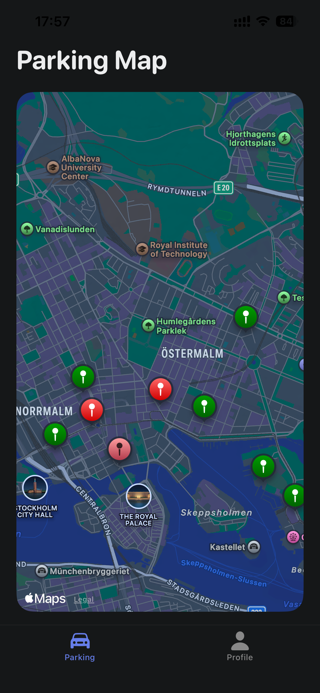

# IoT Smart Parking System

Modern smart parking management system with React Native mobile app and Node.js backend.

## Tech Stack

- Mobile: React Native + Expo + TypeScript
- Backend: Node.js + Express + TypeScript + Prisma + PostgreSQL

## Prerequisites

- Node.js >= 18.x
- pnpm >= 8.x
- Docker & Docker Compose

## 📱 Mobile App Features

- Tab-based navigation
- Cross-platform support (iOS, Android, Web)
- Modern UI with Expo components
- Type-safe routing with Expo Router

## 🖥️ Server Features

- RESTful API endpoints
- TypeScript for type safety
- CORS enabled
- Environment-based configuration
- Health check endpoint

## Quick Start

```bash
# 1. Install
git clone <repository-url>
cd iot-smart-parking-system
pnpm install

# 2. Start database
docker-compose up -d

# 3. Setup backend
cp apps/server/.env.example apps/server/.env
cd apps/server
pnpm prisma:generate
pnpm prisma:migrate
pnpm prisma:seed
cd ../..

# 4. Start dev
pnpm run dev
```

## Access

- Mobile: Scan QR with Expo Go
- Server: http://localhost:3000
- Swagger: http://localhost:3000/api-docs
- Prisma Studio: `pnpm --filter server prisma:studio` → http://localhost:5555
- pgAdmin: http://localhost:5050 (admin@parking.com / admin)

## Commands

```bash
# Run
pnpm run dev                       # Both apps
pnpm --filter mobile start         # Mobile only
pnpm --filter server dev           # Server only

# Database
pnpm --filter server prisma:migrate    # Run migrations
pnpm --filter server prisma:studio     # Open GUI
pnpm --filter server prisma:seed       # Seed data

# Code quality
pnpm lint && pnpm format
```

## Database

**PostgreSQL**: `localhost:5432` / `smart_parking` / `parking_user` / `parking_password`

**pgAdmin**: Use host `postgres` (not localhost) when adding server

## Test Accounts

- `admin@parking.com` / `admin123`
- `user@parking.com` / `user123`

## 📦 Managing Dependencies

### Add Dependencies to Specific Workspace

```bash
# Add to mobile app
pnpm --filter mobile add <package-name>

# Add to server
pnpm --filter server add <package-name>

# Add dev dependency
pnpm --filter mobile add -D <package-name>
```

### Examples

```bash
# Add React Native UI library to mobile
pnpm --filter mobile add react-native-paper

# Add database library to server
pnpm --filter server add mongoose

# Add testing library to server
pnpm --filter server add -D jest @types/jest
```

## 🤝 Contributing

1. Follow the ESLint and Prettier configurations
2. Write meaningful commit messages
3. Test your changes before committing
4. Keep dependencies up to date

## Preview




### Demo Video

https://private-user-images.githubusercontent.com/29733380/530798908-767aa198-3d44-4c37-b058-83441419e47f.mp4?jwt=eyJ0eXAiOiJKV1QiLCJhbGciOiJIUzI1NiJ9.eyJpc3MiOiJnaXRodWIuY29tIiwiYXVkIjoicmF3LmdpdGh1YnVzZXJjb250ZW50LmNvbSIsImtleSI6ImtleTUiLCJleHAiOjE3NjcwMzM5MzgsIm5iZiI6MTc2NzAzMzYzOCwicGF0aCI6Ii8yOTczMzM4MC81MzA3OTg5MDgtNzY3YWExOTgtM2Q0NC00YzM3LWIwNTgtODM0NDE0MTllNDdmLm1wND9YLUFtei1BbGdvcml0aG09QVdTNC1ITUFDLVNIQTI1NiZYLUFtei1DcmVkZW50aWFsPUFLSUFWQ09EWUxTQTUzUFFLNFpBJTJGMjAyNTEyMjklMkZ1cy1lYXN0LTElMkZzMyUyRmF3czRfcmVxdWVzdCZYLUFtei1EYXRlPTIwMjUxMjI5VDE4NDAzOFomWC1BbXotRXhwaXJlcz0zMDAmWC1BbXotU2lnbmF0dXJlPTNhNTFjOWUxNTIxODVlYTc4ZWYzMTY2YmQ1ZWNlYWJmZjhiYmRlOTdhYjVjYTcxYjEzNzYyNmYwYTgzZDlhNWQmWC1BbXotU2lnbmVkSGVhZGVycz1ob3N0In0.IO9eBPakIDKPMPBJqZG3FBzCWV3zrnuH2YL1FJlSeM0

## 📄 License

ISC
